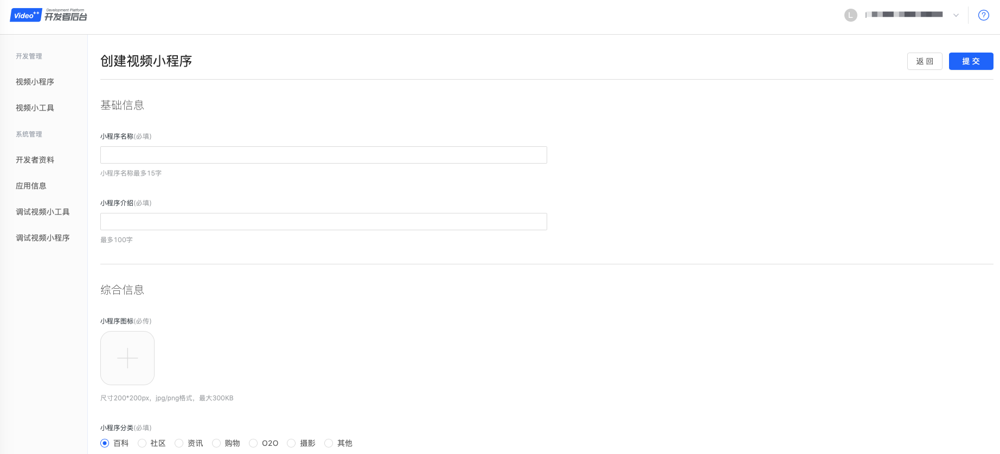
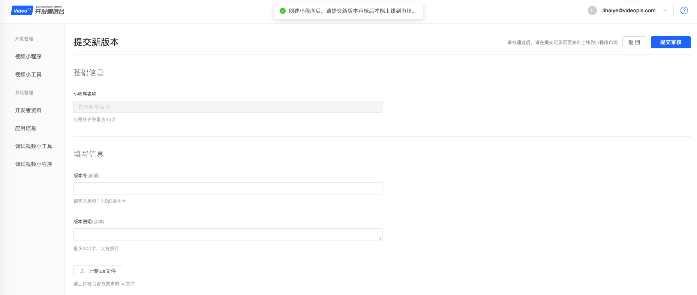

#创建视频小程序
1. 进入[开发者后台](http://os.videojj.com/developer?from=devdoc)，点击左侧菜单“视频小程序”。

2. 点击“创建小程序”按钮，进入页面。

填写相应的小程序信息，具体如下。   
>小程序名称，系统会提醒你是否和其他小程序的名称重复。  
>小程序介绍。是指这个小工具有什么功能，有什么用途。  
>小程序图标。会显示在小程序市场即用户视频桌面。  
>小程序分类。建议选择合适的分类，系统会推荐给合适的用户使用。  
  
3.点击“提交”按钮，创建成功。系统会提示你“创建小程序后，请提交新版本审核后才能上线到市场。”并自动进入到页面[提交新版本](./submit-new-miniprogram-version.md)。
