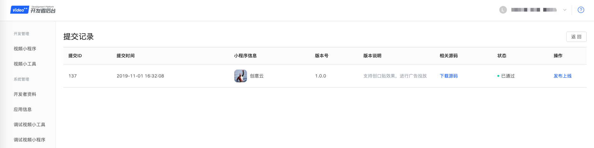
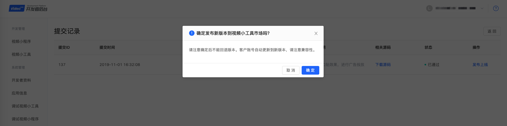
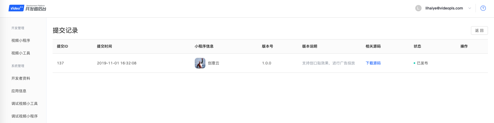

#发布上线视频小工具
[提审小工具](./submit-new-minitool-version.md)之后，请耐心等待2个工作日。当收到审核通过的通知后，则可以选择发布上线。

1. 点击左侧菜单“视频小工具”，点击相应小程序后面的“提交记录”按钮。

2. 点击“发布上线”按钮，弹窗如下。

3. 点击“确定”按钮，则立即发布到视频小工具市场。

4.打开[小工具市场](http://os.videojj.com/market)，查看我们刚刚发布的小工具。

注意：如需小程序功能，请使用[提交新版本](./submit-new-minitool-version.md)。
