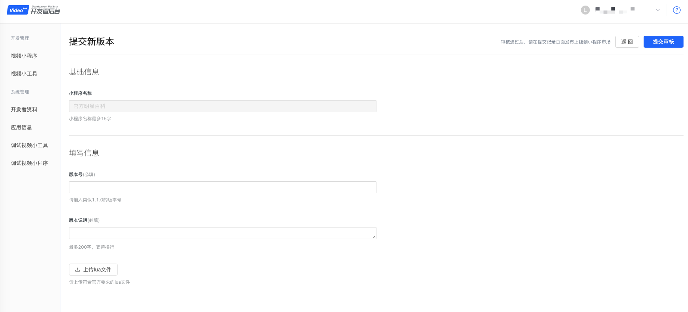
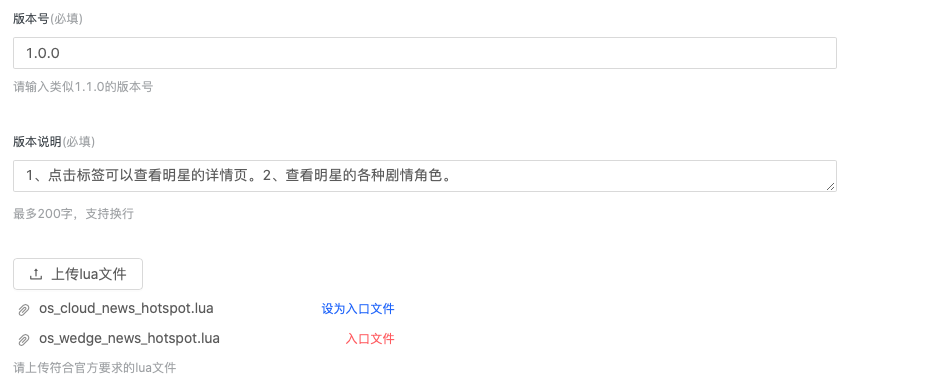
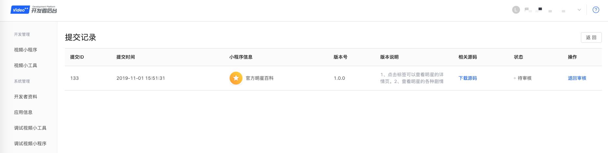

#提交视频小程序的新版本
提审前请开发者先在开发者APP上调试小程序并经过充分的测试，再来提交审核。
   
1. 点击左侧菜单“视频小程序”，点击“提交新版本”按钮。

2. 填写相应的提交信息。 请输入标准格式的版本号，比如V1.1.0。不规范的版本号有可能会被拒审。  
>请填写相应的版本说明，更新了哪些功能，修复了哪些bug，优化了哪些功能。 
>上传lua文件。即上传源码，请注意必须使用lua格式的文件，并且注意谁是入口文件。其他文件都是供入口文件去调用的。

3. 点击“提交审核”按钮，进行提交。系统自动进入提交记录页面。

4. 请耐心等待2个工作日，然后在该页面查看审核结果。