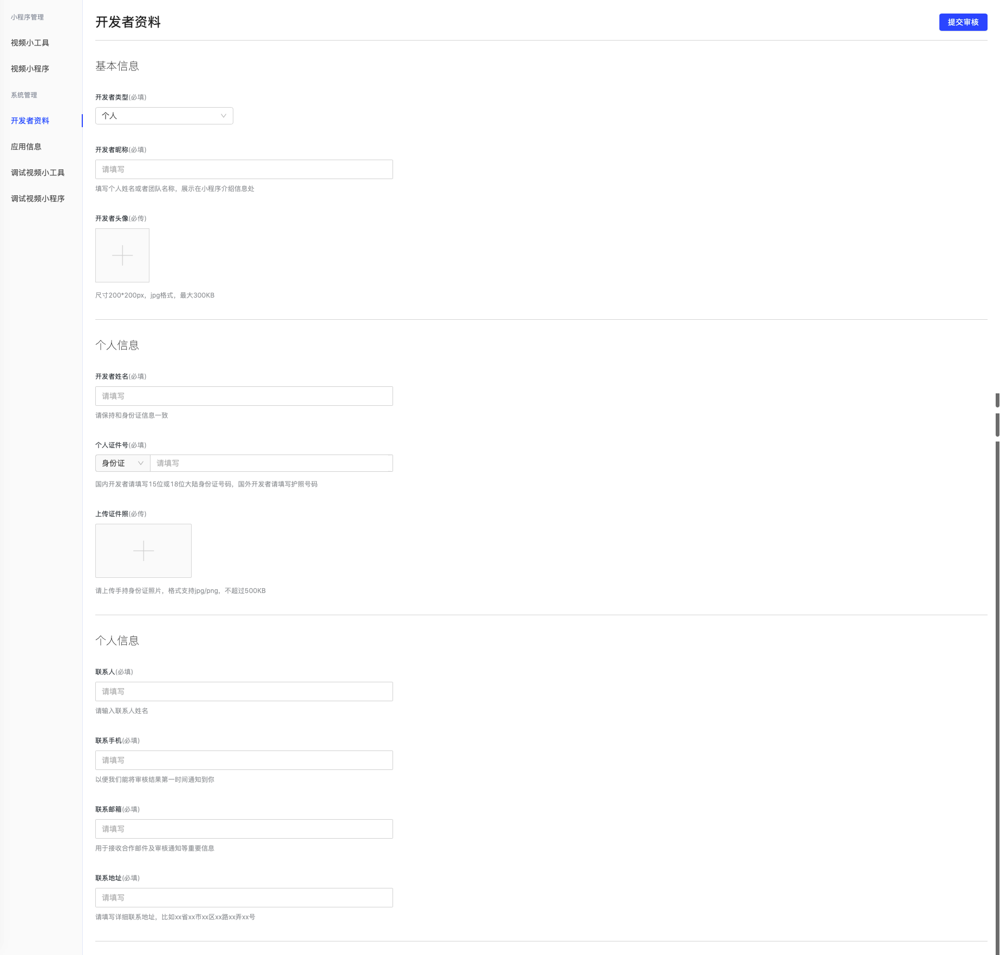
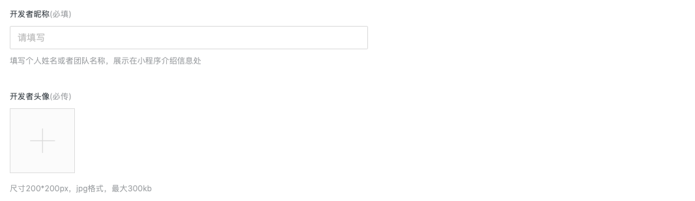
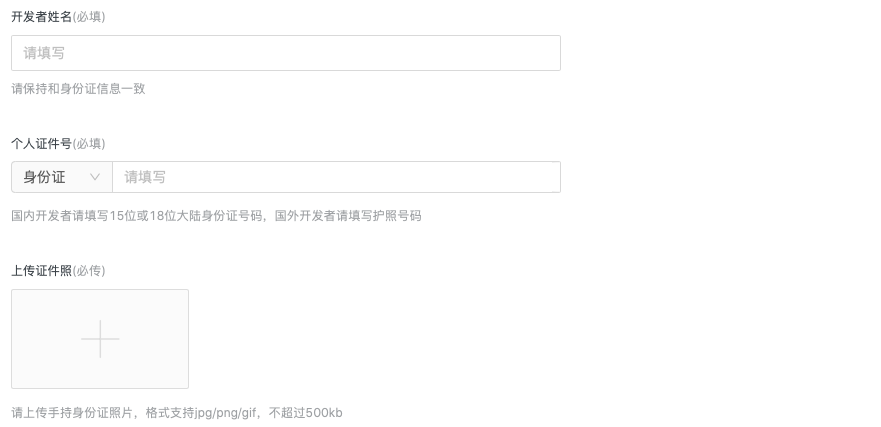
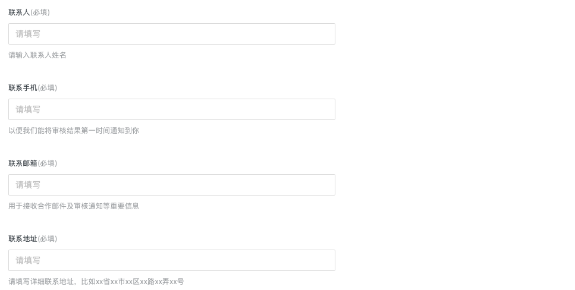

# 提交开发资质

1. 点击左侧菜单“开发者资料”，进入相应页面。注意如果不提交资质是不能创建小程序的，所以请花费您一分钟时间快速提交一下。  
  
2. 填写开发者昵称和头像。到时候会显示在你开发的小程序的介绍页面。  
  
3. 填写开发者相关资料。
如果你是个人开发者。则填写姓名和证件号码，请保持和身份证/护照信息一致。并上传手持证件照片。  
  
如果你是企业开发者。则填写企业的完整名称，并输入营业执照号码，并上传清晰的营业执照副本的照片或者扫描件。  
  

5. 填写联系人的资料，包括姓名，手机号码，邮箱，联系地址。以方便联系到你们。  
  

6. 点击“确定”按钮进行提交审核，通常1个工作日内会收到反馈结果并收到短信通知。  

7. 得到审核结果。
如果审核通过，则这里显示已通过审核。  
  
如果审核失败，则这里会显示被拒绝的原因。需要修改资料并重新提交。 
8. 点击左侧菜单“应用信息”，获得相应的appkey和appsecret。